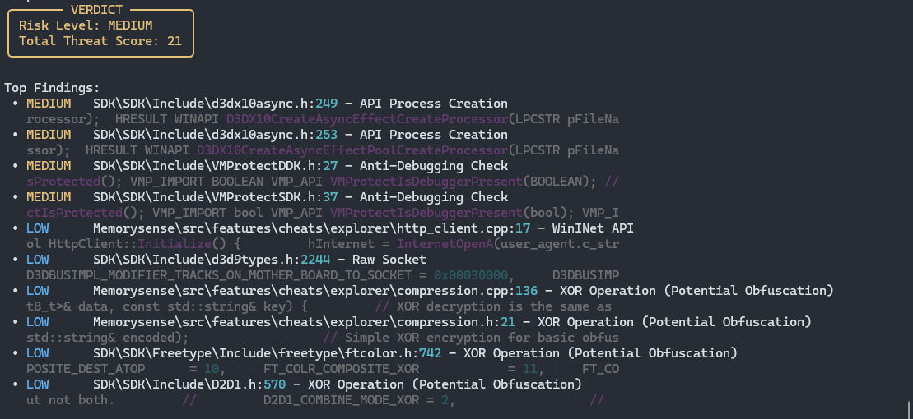

# RedFlag


**RedFlag** is a static analysis tool designed to inspect C++ projects, Visual Studio solutions, and build systems for risky behaviors.

Unlike standard linters that look for syntax errors, RedFlag scans source code and build events for execution anomalies, obfuscation, crypto misuse, and hidden payloads. It correlates these signals to provide a transparent risk score, helping ~~security researchers and developers~~ pasters identify potential malware or malicious code injection in third-party projects.


- [Why RedFlag?](#why-redflag)
- [Features](#features)
- [Installation](#installation)
- [How to Use](#how-to-use)
- [How it Works](#how-it-works)
- [Screenshots](#screenshots)
- [Contributing](#contributing)
- [License](#license)

---


When cloning repositories or inheriting legacy C++ projects, it is difficult to spot malicious intent hidden deep within build configurations. A project might look clean in the `.cpp` files but execute a reverse shell via a `PostBuildEvent` in the `.vcxproj` file.

**RedFlag solves this by:**

1.   It parses `.vcxproj` files to find hidden commands in Pre/Post build events.
2.   It doesn't just look for strings; it scores context (e.g., Crypto APIs used alongside Network APIs).
3.   It automatically extracts and decodes Base64 blobs to check for high-entropy malicious code.

---


*   
    Detects `PowerShell`, `cmd.exe`, `curl`, and `wget` commands buried in Visual Studio build events.

*   
    Scans for specific API categories:
    *    `ShellExecute`, `CreateProcess`, `system()`
    *    `VirtualAlloc`, `ReflectiveLoader`, `WriteProcessMemory`
    *    `URLDownloadToFile`, `socket`, `InternetOpen`
    *    `CryptEncrypt`, `Xor`, `FromBase64String`

*   
    Identifies high-entropy strings and Base64 encoded blobs that often hide shellcode.

*   
    Assigns a severity level (LOW, MEDIUM, HIGH, CRITICAL) based on a weighted scoring system.

*   
    Uses the `rich` library for formatted tables, progress bars, and colored output.

---


You need **Python 3** installed on your machine.

**1. Clone the repository:**
```bash
git clone https://github.com/yourusername/redflag.git
cd redflag
```

**2. Install dependencies:**
For the best visual experience, install the `rich` library. The tool will still work without it, but the output will be plain text.
```bash
pip install rich
```

---


You can run RedFlag against a single file or an entire directory (like a Visual Studio project folder).


```bash
python redflag.py "C:\Path\To\Suspicious\Project"
```


If you run the script without arguments, it will prompt you for the path:
```bash
python redflag.py
```

---


RedFlag performs analysis in 5 steps:

1.   Identifies if the target is a VS Project, Make project, or single file.
2.   Parses XML in `.vcxproj` files to find command-line executions in build events.
3.   Regex-based scanning of source files (ignoring binary/library files) for suspicious API calls.
4.   Increases the risk score if multiple dangerous categories (e.g., Crypto + Network) appear in the same file.
5.   Calculates a total threat score and provides a final verdict (CLEAN to CRITICAL).

---


<p align="center">
  
</p>

---


This tool is for educational and security research purposes only. Use it to audit your own code or code you have permission to analyze. The authors are not responsible for any misuse of this tool.

---


Distributed under the MIT License. See `LICENSE` for more information.
